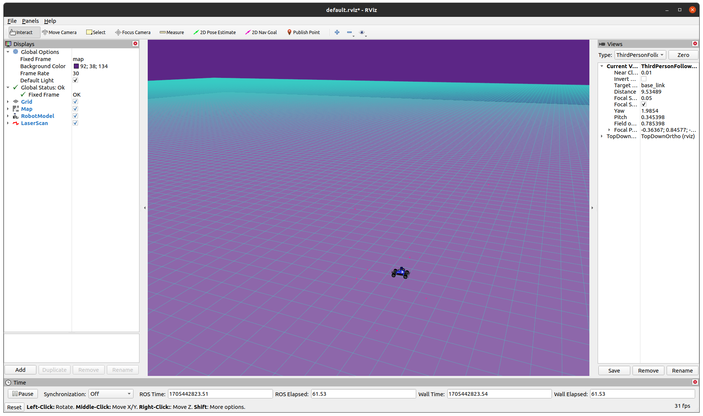

# MuSHR Setup Guide - Fluent Robotics Lab

There is an official tutorial page for MuSHR system, yet it is not very easy to follow as it does not provides a straightforwad flow to follow.

This guide suggest a single flow to follow for setting up the software system for a desktop.

## Setting up on a real robot with Jetson Nano
Refer to [Setting up MuSHR on Real Robot](mushr_onboard_setup.md).


## MuSHR Officitial Tutorial
This guide is written based on the Legacy setup tutorial on MuSHR website. (https://mushr.io/tutorials/quickstart/) This guide aims to upgrade the Ubuntu 20.04. (The official legacy tutorial is written for 18.04 systems.)

### MuSHR Docker (for a reference)
MuSHR website offers a docker containter that has MuSHR system installed on ROS Noetic. It seemingly is possible to use it for desktop environments, but we have not tested it.

https://mushr.io/tutorials/noetic_first_steps/

## Set python as python3
It is highly recommended that we avoid any need for python 2.

```
sudo apt install python-is-python3
```

Alternatively, you may replace all `python` commands with `python3` manually.

## Install tkinter
```
sudo apt install python-tk
```

## (Optional) Install pip
Some Ubuntu does not have pip installed out of the box. Install it if this is the case.


## Install dependencies
```
sudo apt install -y ros-noetic-ackermann-msgs ros-noetic-map-server ros-noetic-serial ros-noetic-urg-node ros-noetic-robot-state-publisher ros-noetic-xacro

sudo apt-get install ros-noetic-realsense2-description

#if Cython is not installed
sudo pip install Cython
```

## Download MuSHR packages

```
cd ~/catkin_ws/src
git clone https://github.com/prl-mushr/mushr_sim.git -b master
git clone https://github.com/prl-mushr/mushr.git -b master
git clone https://github.com/prl-mushr/range_libc -b python3

# continue cloning in mushr_base folder
cd mushr && mkdir mushr_base && cd mushr_base
git clone https://github.com/prl-mushr/mushr_base.git -b master
git clone https://github.com/prl-mushr/vesc.git -b master
```
## Install rangelibc (before catkin_make)
```
cd ~/catkin_ws/src/range_libc/pywrapper
sudo python setup.py install

# remove range_libc source files
cd ~/catkin_ws/src && sudo rm -rf range_libc
```

## Build ROS workspace
```
cd ~/catkin_ws && catkin_make
```

## Changes for Python3

On Ubuntu 20.04 with ROS noetic, the teleoperation package will not run properly. Make the following change so it works with python3.


```
sed -i 's/Tkinter/tkinter/' ~/catkin_ws/src/mushr_sim/src/keyboard_teleop.py
```

## Run teleoperation node

```
roslaunch mushr_sim teleop.launch
```

## RViz
```
rviz -d ~/catkin_ws/src/mushr/mushr_utils/rviz/default.rviz
```

You should now see an RViz screen as below:




## Test teleoperation on RViz
Activate the tkinter window by clicking it, and use `WASD` keys to manipulate the MuSHR car on RViz.